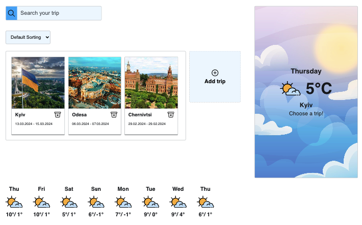

#  Plan a trip and discover Ukraine!

## Description:
**Trip&Weather** application allows to add trips by choosing the city of Ukraine, as well as the start and end date of the trip.

<span>

</span>

### Features:
- Add new trip: click the button for adding a new trip and open modal window:
    - Choose a city from a list;
    - Enter the start date of the trip (the start date should be within the next 15 days)
    - Enter the end date of the trip (the end date should be within the next 15 days)
- Delete the trip
- Sort the trip using the filter by the ascending date of the trip
- The possibility to search for a trip by city name and delete the result
- For each selected city, there is a widget with the current weather, as well as a countdown timer until the start of the planned trip.
- Under the travel section there is a weather forecast for the entire duration of the trip
- Data (trips) stored after reloading page.

## Technologies Used:
- **HTML/CSS** 
- **JavaScript** 
- **Axios** 
- **React** 
- **ReduxToolkit** 
- **Redux Persist**

## API info
1. [Mockapi.io](https://mockapi.io/) - for getting a list of cities, storing and retrieving trips.

2. [Timeline Weather API](https://www.visualcrossing.com/resources/documentation/weather-api/timeline-weather-api/) -  to get the current weather for a specific city and to get a forecast for a certain period of time.


## Getting Started

1. Clone this repository:

```bash
git clone https://github.com/Tinkkid/Plan-and-travel.git
```

2. Install all dependencies:

```bash
npm install
```

3. Set up the necessary environment variables in the .env file.
You cand find expamples in `env.example file`

4. Start project:

```bash
npm run dev
```

5. Open [http://localhost:5173](http://localhost:5173) with your browser (or use a link in the terminal console) to see the result.


## Contacts
If you have any questions, please contact me (I will also be happy to make new professional acquaintances :handshake:):
- :link: Linkedin - Yulia Kostovynska: [](https://www.linkedin.com/in/yuliia-kostovynska/)
- :mailbox: Email y.kostovynska@gmail.com
- :hand: my other projects there - [](https://github.com/Tinkkid?tab=repositories)